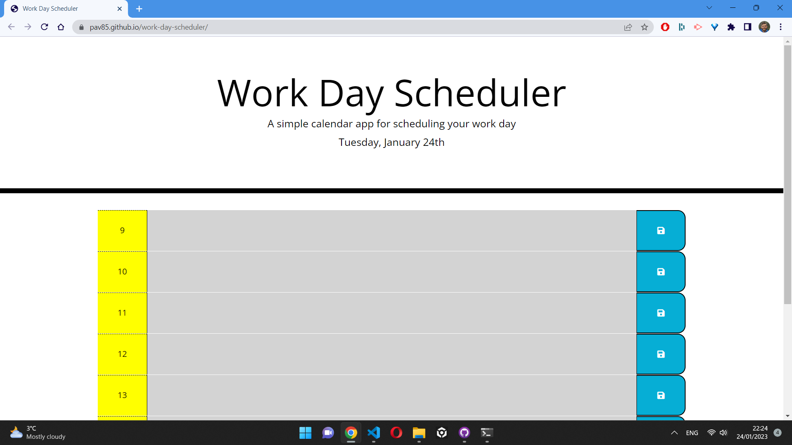

# Week 7 Edx Bootcamp challenge

# work-day-scheduler

## Description 

Simple work day organiser based on standard office hours from 9 - 17. The app is running in a browser and it is made using jQuery.

## Installation

After opening this URL: https://pav85.github.io/work-day-scheduler/ you should see this:

GitHub Repository URL: https://github.com/Pav85/work-day-scheduler

## Usage

* The app displays current work day using moment.js format

  More info at this URL: https://momentjs.com/

* the app allows to input text to each time block which later can be saved to local storage by pressing the save button
* Time blocks appear in different colours depending on time. 
  Grey for past, red for present and green for the future.

## Credits 

N/A

## Licence

MIT Licence

