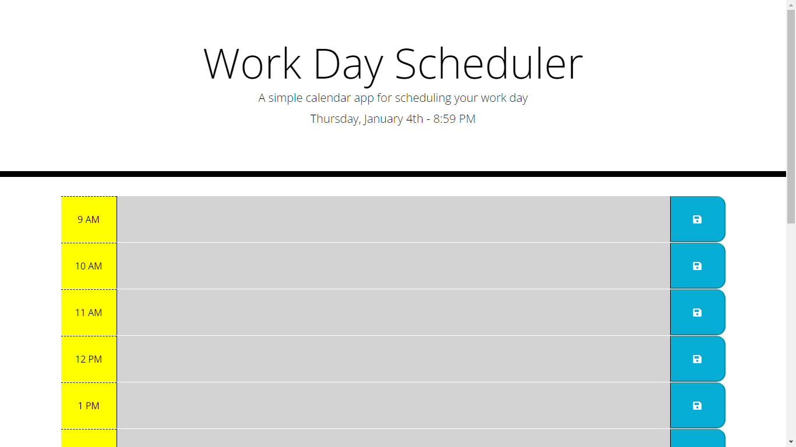

# Work Day Scheduler

## Description 

The Work Day Scheduler is a simple yet effective browser-based application designed to help organize your standard office hours from 9 AM to 5 PM. Developed using jQuery, it leverages the moment.js library to handle date and time functions efficiently.

## Features

- **Dynamic Date and Time Display:** Utilizes moment.js to display the current workday date and time.
- **Interactive Time Blocks:** Offers editable time blocks for each hour of the workday, allowing users to input and save tasks.
- **Color-Coded Time Blocks:** Time blocks are color-coded for ease of use - grey indicates past hours, red represents the current hour, and green signifies future hours.
- **Local Storage Functionality:** Entered data in time blocks can be saved to the browser's local storage, ensuring data persistence.

## Usage

1. **Viewing the Date and Time:** Upon loading, the app displays the current date and time at the top of the page.
2. **Adding Tasks:** Click on the time block for the desired hour and enter your tasks or notes.
3. **Saving Tasks:** Click the save button next to the time block to save your entry to local storage.
4. **Color Indicators:** Use the color coding as a guide for past, present, and future tasks.

## Dependencies

- [jQuery](https://jquery.com/)
- [Moment.js](https://momentjs.com/)
- [Bootstrap](https://getbootstrap.com/)
- [Font Awesome](https://fontawesome.com/)

## Screenshot

## Live Application

Experience the Work Day Scheduler in action: [Live Build](https://pav85.github.io/work-day-scheduler/)

This live version showcases the application's functionality and design, allowing you to interact with the features in real-time.

## Installation

No installation is required. Simply visit the live application link above to start scheduling your workday efficiently.

## Repository

Visit the GitHub repository for source code and contributions: [GitHub - Work Day Scheduler](https://github.com/Pav85/work-day-scheduler)

## License

This project is licensed under the MIT License.

